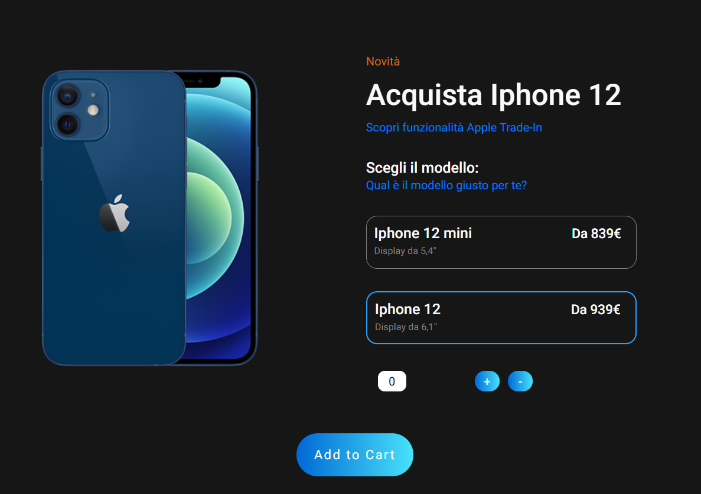

# CounterJS 

First Project with JS man_student

Version 1.0.0

## Creato con :man_technologist:

- HTML
- CSS
- JavaScript

## Descrizione :clipboard:

Questo esercizio è il mio primo progetto JS, l'idea è stata quella di creare un semplice Counter che simuli il carrello di una qualsiasi pagina di shop online, nel mio caso ho voluto replicare quella del sito della Apple (con delle modifiche personali). I pulsanti funzionano per incrementare il numero di fianco (ovvero il counter) e capire quanti oggetti stiamo mettendo nel carrello. Il pulsante Add to Cart invece ci avverte se l'oggetto/i è/sono stati aggiunti al carrello. :ok_hand:

## Cosa aspettarsi :eyes:

La pagina ha il solo scopo di incrementare o decrementare il counter con i pulsanti + e -, il pulsante "Add to Cart" ci permette di aggiungere uno o più prodotti al carrello. Gli altri elementi invece sono solo visivi e mi sono serviti come esercizio per HTML e CSS.

### License & Copyright :closed_lock_with_key:

© Fabio Ciampichetti, Start2Impact Web Developer Student"# Counter" 
